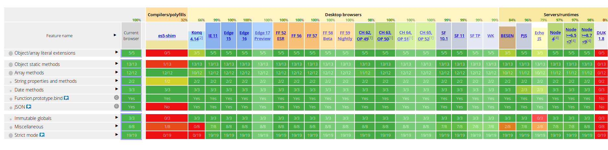
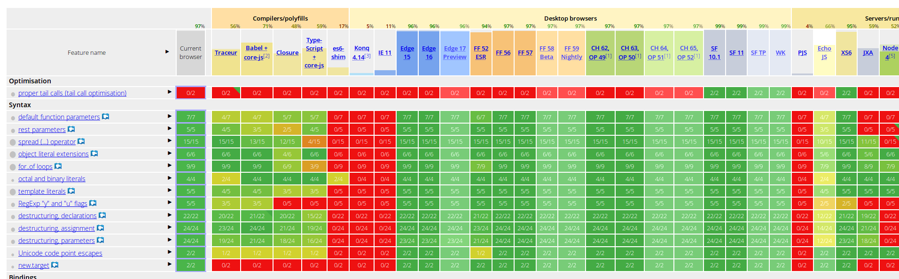

<h1 align="center" style="border-bottom: none;"> Elmélet-002</h1>
<h3 align="center">Webböngészők</h3>

### JavaScript:

A JavaScript (JS) programozási nyelv egy objektumalapú, prototípus alapú szkriptnyelv, amelyet weboldalakon elterjedten használnak. A JavaScript egy úgynevezett interpretált szkriptnyelv, ami annyit tesz, hogy a programkód egy futtatókörnyezetben (a mi esetünkben ez a böngésző) fut közvetlenül, fordítás nélkül. A program egy speciális programozási interfészen (API) keresztül kommunikál a böngészőprogrammal, illetve a megjelenített weboldallal.

### ECMAScript (ES):

Javascript szabványosítása 1997-től.
2015-től kiadási év alapján nevezik el őket. (ES6 = ES 2015)

| Verzió  | Kiadás dátuma  | Változások |
|---|---|---|
| 1 | '97 június | Első verzió |
| 2 | '98 június | Szerkesztési változtatások a specifikáció teljes megfeleléséhez az ISO / IEC 16262 nemzetközi szabványnak megfelelően  |
| 3 | 99' december | reguláris kifejezések, jobb string kezelés, try/catch kivétel kezelés, numerikus kimenet formázása  |
| 4 | Nem lett kiadva | - |
| 5 | '09 december  | "strict mode", getter és setter, JSON-t támogató könyvtár  |
| 6 | '15 június  | osztályok, modulok, iterátorok for/of, arrow functions, collections, promises, stb... |
| 7 | '16 június  | Array.prototype.include, the exponentiation operator (**)  |
| 8 | '17 június | syntactic integration with promises (async/await).  |
| 9 | '18 június  | asynchronous iteration and generators, new regular expression features and rest/spread parameters.  |

### ES5, ES6, 2016+ aktuális támogatása böngészőként:

http://kangax.github.io/compat-table/es6/

#### ES5 támogatás:

#### ES6 (ES 2015) támogatás:

### Babel js:

ES6-os kódot (is) "fordít" ES5-ös kódra ezáltal több (vagy régebbi) böngésző motor is támogatni fogja az új ECMAScript kiadásokat is.

online editor: [itt](https://babeljs.io/repl)